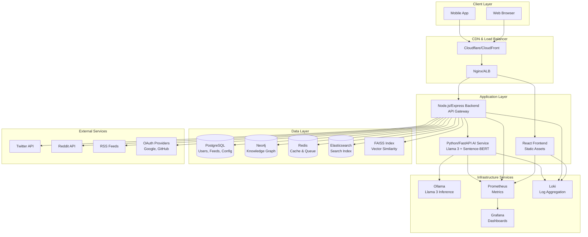

# Production Implementation Plan: Social AI for Curated Content (Brain Rot Filter)

**Document Version:** 1.0  
**Date:** 2026-01-09  
**Project Status:** ~20% Complete (Prototype)

---

## 1. Executive Summary

### 1.1 Current State Assessment

The "Social AI for Curated Content" project is currently in a prototype state with significant gaps preventing production deployment. The application demonstrates core concepts but lacks essential production-ready features.

**Working Components:**
- Basic frontend with React/Vite, Tailwind CSS, and React Query
- Backend API structure with Express and TypeScript
- Feed aggregation from RSS, Twitter, and Reddit (with caching)
- Basic UI for feed display, graph view, and settings
- Configuration management system

**Critical Gaps:**
- **AI Filtering**: Placeholder implementation only, no actual Llama 3 integration
- **Knowledge Graph**: Mock data, no Neo4j integration
- **Authentication**: No OAuth, no user management, no session handling
- **Security**: Hardcoded credentials, no encryption, no input validation
- **Database Persistence**: PostgreSQL, Neo4j, Redis configured but not utilized
- **Testing**: Zero test coverage
- **Documentation**: Minimal, missing API docs, deployment guides
- **Error Handling**: Basic try-catch blocks, no structured logging
- **CI/CD**: No pipeline, no automated testing or deployment
- **Monitoring**: No observability, no metrics, no alerting

### 1.2 Production Readiness Score

| Category | Score (0-10) | Status |
|----------|--------------|--------|
| Core Functionality | 3 | Partial |
| Authentication & Authorization | 0 | Not Started |
| Security | 1 | Critical Issues |
| Database Integration | 1 | Configured but Unused |
| AI/ML Integration | 1 | Placeholder Only |
| Testing | 0 | Not Started |
| Documentation | 2 | Minimal |
| CI/CD | 0 | Not Started |
| Monitoring & Logging | 1 | Basic Console Logs |
| Performance | 4 | Meets Basic Requirements |
| **Overall** | **1.3** | **Not Production Ready** |

### 1.3 Key Risks and Challenges

**Technical Risks:**
1. **AI Model Integration Complexity**: Llama 3 integration via Ollama requires GPU resources and may have latency issues
2. **Knowledge Graph Scalability**: Neo4j performance with 100+ users and growing content
3. **Real-time Performance**: Meeting <1s feed load with AI filtering across multiple sources
4. **Multi-service Coordination**: Coordinating frontend, backend, AI service, and databases

**Security Risks:**
1. **Credential Management**: Hardcoded credentials in [`docker-compose.yml`](docker-compose.yml:8-10,21)
2. **No Authentication**: Anyone can access all features and data
3. **Input Validation**: Missing sanitization for user inputs and external feeds
4. **Data Privacy**: No encryption for sensitive data

**Operational Risks:**
1. **Resource Requirements**: GPU requirements may limit deployment options
2. **API Rate Limits**: Twitter and Reddit APIs have strict rate limits
3. **Feed Source Reliability**: External feeds may fail or change format
4. **Team Knowledge Gap**: Complex tech stack requires specialized skills

### 1.4 Recommended Timeline

**Total Estimated Duration:** 12-16 weeks for production readiness

| Phase | Duration | Start | End |
|-------|----------|-------|-----|
| Phase 1: Critical Fixes | 2 weeks | Week 1 | Week 2 |
| Phase 2: Core Features | 4 weeks | Week 3 | Week 6 |
| Phase 3: Advanced Features | 4 weeks | Week 7 | Week 10 |
| Phase 4: Production Hardening | 3 weeks | Week 11 | Week 13 |
| Phase 5: Launch Preparation | 2 weeks | Week 14 | Week 15 |
| Buffer | 1 week | Week 16 | Week 16 |

---

## 2. Phase-Based Implementation Roadmap

### Phase 1: Critical Fixes (Weeks 1-2)

**Objectives:**
- Fix critical runtime errors
- Remove hardcoded credentials
- Establish basic security foundation
- Set up development environment standards

**Deliverables:**
- Working application without runtime errors
- Environment-based configuration
- Basic logging infrastructure
- Initial test framework setup

**Tasks:**

| Priority | Task | Dependencies | Success Criteria |
|----------|------|--------------|------------------|
| P0 | Create missing [`settings.json`](backend/src/config/settings.json) file with default configuration | None | Application starts without errors |
| P0 | Remove hardcoded credentials from [`docker-compose.yml`](docker-compose.yml:8-10,21) | None | All credentials use environment variables |
| P0 | Implement environment variable loading with validation | Create .env.example | All required env vars validated on startup |
| P0 | Add structured logging (Winston for Node.js, Python logging) | None | All services write structured logs to stdout |
| P1 | Add input validation middleware for all API endpoints | None | Invalid requests return 400 with error details |
| P1 | Create default configuration template | settings.json creation | New developers can start with template |
| P1 | Set up Jest test framework in backend | None | `npm test` runs without errors |
| P1 | Set up Pytest framework in AI service | None | `pytest` runs without errors |
| P2 | Add health check endpoints for all services | Logging | `/health` returns service status |

**Dependencies Between Phases:**
- Phase 2 depends on Phase 1 completion (stable foundation)
- Phase 3 depends on Phase 2 completion (core features needed)
- Phase 4 depends on Phase 3 completion (features to harden)
- Phase 5 depends on Phase 4 completion (production-ready code)

**Success Criteria:**
- Application starts and runs without errors
- All hardcoded credentials removed
- Health checks pass for all services
- Test frameworks configured and running

---

### Phase 2: Core Features (Weeks 3-6)

**Objectives:**
- Implement authentication and authorization
- Integrate databases for persistence
- Implement actual AI filtering with Llama 3
- Add user management

**Deliverables:**
- OAuth 2.0 authentication system
- PostgreSQL database with user and content schemas
- Working AI filtering with Llama 3
- User-specific feeds and settings

**Tasks:**

| Priority | Task | Dependencies | Success Criteria |
|----------|------|--------------|------------------|
| P0 | Design and implement PostgreSQL schema | Phase 1 | Tables created with migrations |
| P0 | Implement OAuth 2.0 (Google, GitHub) | PostgreSQL schema | Users can authenticate via OAuth |
| P0 | Create user model and service | PostgreSQL schema | User CRUD operations work |
| P0 | Implement session management (JWT) | OAuth | Authenticated users receive JWT tokens |
| P0 | Integrate Llama 3 via Ollama in AI service | Phase 1 | `/filter` endpoint returns real AI scores |
| P0 | Implement Sentence-BERT for embeddings | Llama 3 | Content embeddings generated |
| P0 | Set up Redis for caching | Phase 1 | Feed data cached in Redis |
| P1 | Create Neo4j graph schema | Phase 1 | Graph database initialized |
| P1 | Implement entity extraction (NER) | Llama 3 | Entities extracted from content |
| P1 | Store feed items in PostgreSQL | PostgreSQL schema | Feed items persist across restarts |
| P1 | Store entities and relationships in Neo4j | Neo4j schema | Knowledge graph populated |
| P1 | Implement user-specific feed filtering | User model | Each user sees personalized feed |
| P2 | Add password reset flow | OAuth | Users can reset passwords |
| P2 | Implement rate limiting per user | Session | API endpoints respect rate limits |

**Success Criteria:**
- Users can sign up and authenticate
- Feed items persist in database
- AI filtering works with real Llama 3 model
- Knowledge graph stores entities and relationships
- Performance targets met (<1s feed load)

---

### Phase 3: Advanced Features (Weeks 7-10)

**Objectives:**
- Implement recommender system
- Add search functionality with Elasticsearch
- Build knowledge graph visualization
- Implement content saving and collections

**Deliverables:**
- Hybrid recommender system (content-based + collaborative)
- Elasticsearch integration for search
- Interactive graph visualization with real data
- User collections and saved items

**Tasks:**

| Priority | Task | Dependencies | Success Criteria |
|----------|------|--------------|------------------|
| P0 | Implement content-based recommender | Phase 2 | Recommendations based on user history |
| P0 | Implement collaborative filtering | Phase 2 | Recommendations based on similar users |
| P0 | Set up Elasticsearch | Phase 1 | Search service running |
| P0 | Index all content in Elasticsearch | PostgreSQL | Search returns relevant results |
| P0 | Implement search API | Elasticsearch | `/search` endpoint works |
| P0 | Connect GraphView to Neo4j data | Phase 2 | Graph shows real entities/relationships |
| P0 | Implement save/bookmark functionality | Phase 2 | Users can save items |
| P0 | Create collections feature | Save feature | Users can organize saved items |
| P1 | Add FAISS for similarity search | Phase 2 | Vector similarity queries work |
| P1 | Implement recommendation API | Recommender | `/recommendations` endpoint returns items |
| P1 | Add search UI component | Search API | Search interface in frontend |
| P1 | Optimize graph rendering performance | GraphView | <500ms for 1,000 nodes |
| P1 | Add recommendation UI | Recommendation API | Recommendations displayed in feed |
| P2 | Implement advanced graph filters | GraphView | Filter by entity type, relationship |
| P2 | Add search history | Search API | User search queries saved |
| P2 | Implement trending topics | Elasticsearch | Trending entities displayed |

**Success Criteria:**
- Recommender system provides relevant suggestions
- Search returns accurate results in <500ms
- Graph visualization renders real data smoothly
- Users can save and organize content

---

### Phase 4: Production Hardening (Weeks 11-13)

**Objectives:**
- Implement comprehensive testing
- Set up CI/CD pipeline
- Add monitoring and observability
- Security hardening

**Deliverables:**
- 80%+ test coverage
- Automated CI/CD pipeline
- Monitoring dashboard
- Security audit passed

**Tasks:**

| Priority | Task | Dependencies | Success Criteria |
|----------|------|--------------|------------------|
| P0 | Write unit tests for backend services | Phase 1 | 80%+ coverage |
| P0 | Write unit tests for AI service | Phase 1 | 80%+ coverage |
| P0 | Write unit tests for frontend components | Phase 1 | 80%+ coverage |
| P0 | Set up GitHub Actions CI pipeline | Unit tests | Tests run on every PR |
| P0 | Implement integration tests | All features | End-to-end flows tested |
| P0 | Add Prometheus metrics | All services | Metrics exported for all services |
| P0 | Set up Grafana dashboard | Prometheus | Dashboard displays key metrics |
| P0 | Implement structured error handling | All services | Errors logged with context |
| P0 | Add request/response logging | All services | All API calls logged |
| P1 | Set up CD pipeline (deployment) | CI pipeline | Auto-deploy to staging on merge |
| P1 | Implement rate limiting middleware | Phase 2 | API limits enforced |
| P1 | Add input sanitization | All endpoints | XSS/SQL injection prevented |
| P1 | Implement CORS properly | All services | CORS configured correctly |
| P1 | Add security headers | All services | Security headers present |
| P1 | Set up log aggregation (Loki/ELK) | Logging | Centralized log viewing |
| P2 | Add performance testing | All features | Load tests for 100+ users |
| P2 | Implement circuit breakers | All services | Failing services don't cascade |
| P2 | Add database connection pooling | Phase 2 | Connection pool configured |
| P2 | Implement retry logic with backoff | All services | Transient errors handled |

**Success Criteria:**
- 80%+ test coverage achieved
- CI/CD pipeline running successfully
- Monitoring dashboard operational
- Security audit passed

---

### Phase 5: Launch Preparation (Weeks 14-15)

**Objectives:**
- Prepare production infrastructure
- Create deployment documentation
- Conduct user acceptance testing
- Prepare launch checklist

**Deliverables:**
- Production infrastructure ready
- Complete deployment documentation
- User acceptance testing complete
- Launch checklist completed

**Tasks:**

| Priority | Task | Dependencies | Success Criteria |
|----------|------|--------------|------------------|
| P0 | Set up production environment | Phase 4 | Production servers running |
| P0 | Configure production databases | Phase 4 | Databases optimized and backed up |
| P0 | Set up SSL/TLS certificates | Production env | HTTPS enabled |
| P0 | Configure production environment variables | Production env | All secrets managed securely |
| P0 | Create deployment runbook | All phases | Step-by-step deployment guide |
| P0 | Create rollback procedures | Deployment | Rollback steps documented |
| P0 | Conduct smoke tests | Production env | All core features work |
| P0 | Performance testing on production | Production env | Performance targets met |
| P1 | Set up backup strategy | Production env | Automated backups configured |
| P1 | Configure alerting | Phase 4 | Alerts for critical issues |
| P1 | Create user documentation | All features | User guide available |
| P1 | Create admin documentation | All features | Admin guide available |
| P1 | Conduct UAT with beta users | All features | User feedback collected |
| P1 | Final security review | Phase 4 | Security sign-off obtained |
| P2 | Set up staging environment | Production env | Staging mirrors production |
| P2 | Create onboarding documentation | All phases | New developer guide available |
| P2 | Prepare launch announcement | All phases | Launch communications ready |

**Success Criteria:**
- Production environment operational
- Documentation complete
- UAT passed
- Launch checklist signed off

---

## 3. Technical Architecture Updates

### 3.1 Current Architecture

```
┌─────────────────────────────────────────────────────────────────┐
│                         Frontend (React)                        │
│                    Vite + TypeScript + Tailwind                 │
└─────────────────────────────┬───────────────────────────────────┘
                              │ HTTP/REST
                              ▼
┌─────────────────────────────────────────────────────────────────┐
│                      Backend (Express/Node)                      │
│                    TypeScript + RSS Parser                       │
└─────────┬───────────────────────┬───────────────────────────────┘
          │                       │
          │                       │
          ▼                       ▼
┌──────────────────┐    ┌──────────────────────────────────────┐
│  AI Service      │    │  External APIs                       │
│  (FastAPI/Python)│    │  - Twitter API                       │
│  - Placeholder   │    │  - Reddit API                        │
└──────────────────┘    │  - RSS Feeds                         │
                        └──────────────────────────────────────┘

┌─────────────────────────────────────────────────────────────────┐
│                    Infrastructure (Docker)                       │
│  - PostgreSQL (configured but unused)                          │
│  - Neo4j (configured but unused)                               │
│  - Redis (configured but unused)                               │
│  - Ollama (configured but not integrated)                      │
└─────────────────────────────────────────────────────────────────┘
```

### 3.2 Recommended Production Architecture



### 3.3 Key Architecture Changes

**1. API Gateway Pattern**
- Backend acts as API gateway
- Routes requests to appropriate services
- Handles authentication, rate limiting, logging

**2. Service Communication**
- Internal services communicate via REST APIs
- Future: Consider gRPC for AI service communication
- Message queue (Redis) for async feed fetching

**3. Data Flow**
```
Feed Fetching Flow:
1. Scheduled job fetches from external APIs
2. Content stored in PostgreSQL
3. AI service analyzes content
4. Entities extracted and stored in Neo4j
5. Embeddings generated and stored in FAISS
6. Content indexed in Elasticsearch
7. Results cached in Redis
```

**4. Caching Strategy**
- L1: In-memory cache (Node.js)
- L2: Redis cache for feed data
- L3: CDN for static assets

**5. Scalability Considerations**
- Horizontal scaling for backend (stateless)
- AI service may need GPU instances
- Read replicas for PostgreSQL
- Neo4j clustering for graph scale

### 3.4 Database Schema Design

#### PostgreSQL Schema

```sql
-- Users
CREATE TABLE users (
    id UUID PRIMARY KEY DEFAULT gen_random_uuid(),
    email VARCHAR(255) UNIQUE NOT NULL,
    username VARCHAR(100) UNIQUE NOT NULL,
    password_hash VARCHAR(255), -- For password auth
    oauth_provider VARCHAR(50), -- 'google', 'github'
    oauth_id VARCHAR(255), -- Provider's user ID
    avatar_url VARCHAR(500),
    created_at TIMESTAMP DEFAULT CURRENT_TIMESTAMP,
    updated_at TIMESTAMP DEFAULT CURRENT_TIMESTAMP
);

-- User Sessions
CREATE TABLE sessions (
    id UUID PRIMARY KEY DEFAULT gen_random_uuid(),
    user_id UUID NOT NULL REFERENCES users(id) ON DELETE CASCADE,
    token VARCHAR(500) UNIQUE NOT NULL,
    expires_at TIMESTAMP NOT NULL,
    created_at TIMESTAMP DEFAULT CURRENT_TIMESTAMP
);

-- Feed Sources
CREATE TABLE feed_sources (
    id UUID PRIMARY KEY DEFAULT gen_random_uuid(),
    user_id UUID REFERENCES users(id) ON DELETE CASCADE,
    name VARCHAR(255) NOT NULL,
    url VARCHAR(1000) NOT NULL,
    type VARCHAR(50) NOT NULL, -- 'rss', 'twitter', 'reddit'
    is_active BOOLEAN DEFAULT true,
    fetch_interval INTEGER DEFAULT 900, -- seconds
    last_fetched_at TIMESTAMP,
    created_at TIMESTAMP DEFAULT CURRENT_TIMESTAMP,
    updated_at TIMESTAMP DEFAULT CURRENT_TIMESTAMP
);

-- Feed Items
CREATE TABLE feed_items (
    id UUID PRIMARY KEY DEFAULT gen_random_uuid(),
    source_id UUID REFERENCES feed_sources(id) ON DELETE CASCADE,
    external_id VARCHAR(255), -- External API's item ID
    title VARCHAR(500) NOT NULL,
    content TEXT,
    link VARCHAR(1000),
    author VARCHAR(255),
    published_at TIMESTAMP,
    fetched_at TIMESTAMP DEFAULT CURRENT_TIMESTAMP,
    ai_score DECIMAL(3,2), -- 0.00 to 1.00
    is_brain_rot BOOLEAN DEFAULT false,
    reasoning TEXT,
    embedding VECTOR(768), -- Sentence-BERT embedding
    created_at TIMESTAMP DEFAULT CURRENT_TIMESTAMP
);

-- Saved Items (Bookmarks)
CREATE TABLE saved_items (
    id UUID PRIMARY KEY DEFAULT gen_random_uuid(),
    user_id UUID NOT NULL REFERENCES users(id) ON DELETE CASCADE,
    feed_item_id UUID NOT NULL REFERENCES feed_items(id) ON DELETE CASCADE,
    collection_id UUID REFERENCES collections(id) ON DELETE SET NULL,
    notes TEXT,
    saved_at TIMESTAMP DEFAULT CURRENT_TIMESTAMP,
    UNIQUE(user_id, feed_item_id)
);

-- Collections
CREATE TABLE collections (
    id UUID PRIMARY KEY DEFAULT gen_random_uuid(),
    user_id UUID NOT NULL REFERENCES users(id) ON DELETE CASCADE,
    name VARCHAR(255) NOT NULL,
    description TEXT,
    created_at TIMESTAMP DEFAULT CURRENT_TIMESTAMP,
    updated_at TIMESTAMP DEFAULT CURRENT_TIMESTAMP
);

-- User Interactions (for collaborative filtering)
CREATE TABLE user_interactions (
    id UUID PRIMARY KEY DEFAULT gen_random_uuid(),
    user_id UUID NOT NULL REFERENCES users(id) ON DELETE CASCADE,
    feed_item_id UUID NOT NULL REFERENCES feed_items(id) ON DELETE CASCADE,
    interaction_type VARCHAR(50) NOT NULL, -- 'view', 'save', 'share', 'like'
    interaction_value INTEGER DEFAULT 1, -- Weight for recommendation
    created_at TIMESTAMP DEFAULT CURRENT_TIMESTAMP,
    UNIQUE(user_id, feed_item_id, interaction_type)
);

-- User Preferences
CREATE TABLE user_preferences (
    id UUID PRIMARY KEY DEFAULT gen_random_uuid(),
    user_id UUID NOT NULL REFERENCES users(id) ON DELETE CASCADE,
    key VARCHAR(100) NOT NULL,
    value TEXT NOT NULL,
    created_at TIMESTAMP DEFAULT CURRENT_TIMESTAMP,
    updated_at TIMESTAMP DEFAULT CURRENT_TIMESTAMP,
    UNIQUE(user_id, key)
);

-- Search History
CREATE TABLE search_history (
    id UUID PRIMARY KEY DEFAULT gen_random_uuid(),
    user_id UUID NOT NULL REFERENCES users(id) ON DELETE CASCADE,
    query TEXT NOT NULL,
    results_count INTEGER,
    created_at TIMESTAMP DEFAULT CURRENT_TIMESTAMP
);

-- Indexes
CREATE INDEX idx_feed_items_source ON feed_items(source_id);
CREATE INDEX idx_feed_items_published ON feed_items(published_at DESC);
CREATE INDEX idx_feed_items_ai_score ON feed_items(ai_score DESC);
CREATE INDEX idx_saved_items_user ON saved_items(user_id);
CREATE INDEX idx_saved_items_collection ON saved_items(collection_id);
CREATE INDEX idx_user_interactions_user ON user_interactions(user_id);
CREATE INDEX idx_user_interactions_item ON user_interactions(feed_item_id);
CREATE INDEX idx_search_history_user ON search_history(user_id);
CREATE INDEX idx_search_history_created ON search_history(created_at DESC);
```

#### Neo4j Graph Schema

```cypher
-- Node Labels
-- Entity: Represents entities extracted from content (people, organizations, topics)
-- Article: Represents feed items/articles
-- User: Represents application users
-- Topic: Represents high-level topics/categories

-- Entity Node Properties
CREATE CONSTRAINT entity_id_unique IF NOT EXISTS FOR (e:Entity) REQUIRE e.id IS UNIQUE;
CREATE INDEX entity_name IF NOT EXISTS FOR (e:Entity) ON (e.name);
CREATE INDEX entity_type IF NOT EXISTS FOR (e:Entity) ON (e.type);

-- Article Node Properties
CREATE CONSTRAINT article_id_unique IF NOT EXISTS FOR (a:Article) REQUIRE a.id IS UNIQUE;
CREATE INDEX article_published IF NOT EXISTS FOR (a:Article) ON (a.published_at);

-- User Node Properties
CREATE CONSTRAINT user_id_unique IF NOT EXISTS FOR (u:User) REQUIRE u.id IS UNIQUE;

-- Topic Node Properties
CREATE CONSTRAINT topic_name_unique IF NOT EXISTS FOR (t:Topic) REQUIRE t.name IS UNIQUE;

-- Relationship Types
-- :MENTIONED_IN - Entity mentioned in Article
-- :AUTHORED_BY - Article authored by Entity (person)
-- :ABOUT - Article about Topic
-- :RELATED_TO - Entity related to Entity
-- :SIMILAR_TO - Article similar to Article
-- :INTERESTED_IN - User interested in Entity
-- :SAVED - User saved Article
-- :BELONGS_TO - Topic belongs to Topic (hierarchy)

-- Example Schema
(:Entity {id, name, type, confidence, source})
(:Article {id, title, url, published_at, aiScore})
(:User {id, username})
(:Topic {id, name, description})

(:Entity)-[:MENTIONED_IN {count, first_mentioned}]->(:Article)
(:Article)-[:AUTHORED_BY]->(:Entity)
(:Article)-[:ABOUT]->(:Topic)
(:Entity)-[:RELATED_TO {strength}]->(:Entity)
(:Article)-[:SIMILAR_TO {similarity}]->(:Article)
(:User)-[:INTERESTED_IN {weight}]->(:Entity)
(:User)-[:SAVED {saved_at}]->(:Article)
(:Topic)-[:BELONGS_TO]->(:Topic)
```

### 3.5 API Design Improvements

#### Authentication Endpoints

```
POST   /api/auth/register          - User registration
POST   /api/auth/login             - User login (email/password)
GET    /api/auth/oauth/:provider   - Initiate OAuth flow
GET    /api/auth/oauth/callback    - OAuth callback
POST   /api/auth/logout            - Logout (invalidate session)
POST   /api/auth/refresh           - Refresh JWT token
POST   /api/auth/forgot-password   - Initiate password reset
POST   /api/auth/reset-password    - Complete password reset
```

#### User Endpoints

```
GET    /api/users/me               - Get current user profile
PUT    /api/users/me               - Update current user profile
DELETE /api/users/me               - Delete account
GET    /api/users/me/preferences   - Get user preferences
PUT    /api/users/me/preferences   - Update user preferences
```

#### Feed Endpoints

```
GET    /api/feeds                  - Get aggregated feed (paginated)
GET    /api/feeds/:id              - Get specific feed item
POST   /api/feeds/sources          - Add feed source
GET    /api/feeds/sources          - Get user's feed sources
PUT    /api/feeds/sources/:id      - Update feed source
DELETE /api/feeds/sources/:id      - Remove feed source
POST   /api/feeds/:id/save         - Save feed item
DELETE /api/feeds/:id/save         - Unsave feed item
```

#### Search Endpoints

```
GET    /api/search                 - Search content (paginated)
GET    /api/search/suggest         - Get search suggestions
GET    /api/search/history         - Get search history
DELETE /api/search/history        - Clear search history
```

#### Graph Endpoints

```
GET    /api/graph/entities         - Get graph entities (paginated)
GET    /api/graph/relationships   - Get relationships for entity
GET    /api/graph/shortest-path    - Find shortest path between entities
GET    /api/graph/neighbors        - Get neighbors of entity
GET    /api/graph/topics          - Get topic hierarchy
```

#### Recommendation Endpoints

```
GET    /api/recommendations        - Get personalized recommendations
GET    /api/recommendations/trending - Get trending content
GET    /api/recommendations/similar/:id - Get similar items
```

#### Collection Endpoints

```
GET    /api/collections            - Get user's collections
POST   /api/collections            - Create collection
GET    /api/collections/:id        - Get collection details
PUT    /api/collections/:id        - Update collection
DELETE /api/collections/:id        - Delete collection
POST   /api/collections/:id/items  - Add item to collection
DELETE /api/collections/:id/items/:itemId - Remove item from collection
```

#### Config Endpoints

```
GET    /api/config                 - Get user configuration
PUT    /api/config                 - Update user configuration
GET    /api/config/prompts         - Get AI filter prompts
PUT    /api/config/prompts         - Update AI filter prompts
```

#### Admin Endpoints

```
GET    /api/admin/users            - List all users (admin only)
GET    /api/admin/stats            - Get platform statistics
POST   /api/admin/feeds/refresh    - Trigger feed refresh
GET    /api/admin/logs             - Get application logs
```

### 3.6 Security Architecture

```
┌─────────────────────────────────────────────────────────────────┐
│                     Security Layers                              │
├─────────────────────────────────────────────────────────────────┤
│ 1. Network Layer                                                │
│    - SSL/TLS for all communication                               │
│    - Firewall rules (only necessary ports)                      │
│    - DDoS protection (Cloudflare)                               │
├─────────────────────────────────────────────────────────────────┤
│ 2. Application Layer                                            │
│    - OAuth 2.0 for authentication                                │
│    - JWT for session management                                 │
│    - Rate limiting per user/IP                                  │
│    - Input validation and sanitization                          │
│    - CORS configuration                                         │
│    - Security headers (HSTS, CSP, etc.)                         │
├─────────────────────────────────────────────────────────────────┤
│ 3. Data Layer                                                   │
│    - Encrypted database connections                             │
│    - Row-level security (RLS) in PostgreSQL                     │
│    - Hashed passwords (bcrypt)                                  │
│    - Sensitive data encryption at rest                          │
├─────────────────────────────────────────────────────────────────┤
│ 4. Infrastructure Layer                                         │
│    - Secrets management (HashiCorp Vault/AWS Secrets Manager)   │
│    - Immutable infrastructure                                   │
│    - Regular security updates                                   │
│    - Vulnerability scanning                                      │
└─────────────────────────────────────────────────────────────────┘
```

**Security Best Practices:**
1. Never log sensitive data (passwords, tokens, PII)
2. Use parameterized queries to prevent SQL injection
3. Implement CSRF protection for state-changing operations
4. Use HTTPS only in production
5. Implement proper session management (secure, httpOnly cookies)
6. Regular dependency updates and security audits
7. Principle of least privilege for database access
8. API versioning for backward compatibility

### 3.7 Deployment Architecture

**Development Environment:**
- Docker Compose on local machine
- Hot reloading enabled
- Debug ports exposed
- Mock external services

**Staging Environment:**
- Single EC2 instance or equivalent
- Docker containers
- Real external APIs (rate-limited)
- Production-like configuration

**Production Environment:**
```
┌─────────────────────────────────────────────────────────────────┐
│                         Cloud Provider                           │
│                    (AWS / GCP / Azure)                          │
├─────────────────────────────────────────────────────────────────┤
│  Load Balancer (ALB / Cloud Load Balancing)                     │
│    - SSL termination                                             │
│    - Health checks                                               │
│    - Auto scaling                                                │
├─────────────────────────────────────────────────────────────────┤
│  Application Servers (EC2 / Cloud Run / GKE)                     │
│    - Frontend: Nginx serving static assets                      │
│    - Backend: Node.js containers (2-4 instances)                 │
│    - AI Service: Python containers with GPU (1-2 instances)     │
├─────────────────────────────────────────────────────────────────┤
│  Databases (Managed Services)                                    │
│    - PostgreSQL: RDS / Cloud SQL                                │
│    - Neo4j: Neo4j AuraDB or self-managed                        │
│    - Redis: ElastiCache / Memorystore                           │
│    - Elasticsearch: OpenSearch Service                          │
├─────────────────────────────────────────────────────────────────┤
│  Storage                                                        │
│    - Static assets: S3 / Cloud Storage                          │
│    - Backups: S3 Glacier / Cloud Storage                        │
├─────────────────────────────────────────────────────────────────┤
│  Monitoring                                                     │
│    - Prometheus + Grafana                                       │
│    - CloudWatch / Stackdriver                                    │
│    - Alerting via PagerDuty / Slack                             │
└─────────────────────────────────────────────────────────────────┘
```

---

## 4. Detailed Task Breakdown

### 4.1 AI/ML Integration

**Current State:** Placeholder implementation in [`ai-service/main.py`](ai-service/main.py:21-29)

**Required Implementation:**

#### Task 4.1.1: Llama 3 Integration via Ollama
**File:** [`ai-service/main.py`](ai-service/main.py)
**Priority:** P0
**Dependencies:** Phase 1 complete

**Subtasks:**
1. Install and configure Ollama client library
2. Implement Llama 3 model loading and inference
3. Create prompt engineering system for brain rot detection
4. Add batch processing for multiple items
5. Implement caching for AI responses
6. Add fallback mechanism when Ollama is unavailable

**Implementation Details:**
```python
# ai-service/models/llama.py
import ollama
from typing import Dict, List

class LlamaFilter:
    def __init__(self, model_name: str = "llama3"):
        self.model_name = model_name
        self.client = ollama.Client()
    
    def filter_content(self, text: str, context: str = "") -> Dict:
        prompt = self._build_prompt(text, context)
        response = self.client.chat(model=self.model_name, messages=[
            {"role": "system", "content": context},
            {"role": "user", "content": text}
        ])
        return self._parse_response(response)
```

#### Task 4.1.2: Sentence-BERT Integration
**File:** New file `ai-service/models/sentence_bert.py`
**Priority:** P0
**Dependencies:** Phase 1 complete

**Subtasks:**
1. Install sentence-transformers library
2. Load pre-trained Sentence-BERT model
3. Implement embedding generation for content
4. Add batch embedding support
5. Store embeddings in PostgreSQL (pgvector extension)
6. Implement similarity search

**Implementation Details:**
```python
# ai-service/models/sentence_bert.py
from sentence_transformers import SentenceTransformer
import numpy as np

class SentenceBERTEmbedder:
    def __init__(self, model_name: str = "all-MiniLM-L6-v2"):
        self.model = SentenceTransformer(model_name)
    
    def generate_embedding(self, text: str) -> List[float]:
        return self.model.encode(text).tolist()
    
    def generate_batch_embeddings(self, texts: List[str]) -> List[List[float]]:
        return self.model.encode(texts).tolist()
```

#### Task 4.1.3: Named Entity Recognition (NER)
**File:** New file `ai-service/models/ner.py`
**Priority:** P1
**Dependencies:** Llama 3 integration complete

**Subtasks:**
1. Install Hugging Face transformers library
2. Load pre-trained NER model (e.g., spaCy or Hugging Face)
3. Implement entity extraction from content
4. Classify entities (PERSON, ORG, TOPIC, etc.)
5. Extract entity relationships
6. Store entities in Neo4j

**Implementation Details:**
```python
# ai-service/models/ner.py
from transformers import pipeline

class EntityExtractor:
    def __init__(self):
        self.ner_pipeline = pipeline("ner", 
                                     model="dbmdz/bert-large-cased-finetuned-conll03-english",
                                     aggregation_strategy="simple")
    
    def extract_entities(self, text: str) -> List[Dict]:
        entities = self.ner_pipeline(text)
        return [
            {
                "text": e["word"],
                "type": e["entity_group"],
                "confidence": e["score"],
                "start": e["start"],
                "end": e["end"]
            }
            for e in entities
        ]
```

#### Task 4.1.4: FAISS Vector Index
**File:** New file `ai-service/vector_store/faiss_index.py`
**Priority:** P1
**Dependencies:** Sentence-BERT integration complete

**Subtasks:**
1. Install faiss-cpu or faiss-gpu library
2. Create FAISS index for embeddings
3. Implement add, search, and remove operations
4. Persist index to disk
5. Add index rebuilding capability
6. Implement batch operations

**Implementation Details:**
```python
# ai-service/vector_store/faiss_index.py
import faiss
import numpy as np
import pickle

class FAISSIndex:
    def __init__(self, dimension: int = 384):
        self.dimension = dimension
        self.index = faiss.IndexFlatL2(dimension)
        self.ids = []
    
    def add(self, embedding: np.ndarray, item_id: str):
        self.index.add(embedding.reshape(1, -1))
        self.ids.append(item_id)
    
    def search(self, embedding: np.ndarray, k: int = 10):
        distances, indices = self.index.search(embedding.reshape(1, -1), k)
        return [
            {"id": self.ids[i], "distance": float(d)}
            for i, d in zip(indices[0], distances[0])
        ]
```

#### Task 4.1.5: Recommendation Pipeline
**File:** New file `ai-service/pipelines/recommendation.py`
**Priority:** P0
**Dependencies:** All AI models integrated

**Subtasks:**
1. Implement content-based filtering (using embeddings)
2. Implement collaborative filtering (using user interactions)
3. Create hybrid recommendation system
4. Add personalization based on user history
5. Implement diversity in recommendations
6. Add explainability features

**Implementation Details:**
```python
# ai-service/pipelines/recommendation.py
from typing import List, Dict

class RecommendationEngine:
    def __init__(self, content_filter, collaborative_filter):
        self.content_filter = content_filter
        self.collaborative_filter = collaborative_filter
    
    def get_recommendations(self, user_id: str, n: int = 10) -> List[Dict]:
        content_recs = self.content_filter.recommend(user_id, n)
        collab_recs = self.collaborative_filter.recommend(user_id, n)
        return self._merge_and_rank(content_recs, collab_recs, n)
```

---

### 4.2 Authentication & Authorization

**Current State:** None

**Required Implementation:**

#### Task 4.2.1: User Model and Database Schema
**File:** New file `backend/src/models/User.ts`
**Priority:** P0
**Dependencies:** Phase 1 complete

**Subtasks:**
1. Define User interface and TypeScript types
2. Create user database table with migrations
3. Implement password hashing with bcrypt
4. Add user CRUD operations
5. Create user preferences storage
6. Add user activity tracking

**Implementation Details:**
```typescript
// backend/src/models/User.ts
export interface User {
  id: string;
  email: string;
  username: string;
  passwordHash?: string;
  oauthProvider?: string;
  oauthId?: string;
  avatarUrl?: string;
  createdAt: Date;
  updatedAt: Date;
}

export interface UserPreferences {
  userId: string;
  key: string;
  value: string;
}
```

#### Task 4.2.2: OAuth 2.0 Implementation
**File:** New files in `backend/src/services/auth/`
**Priority:** P0
**Dependencies:** User model complete

**Subtasks:**
1. Install passport and OAuth strategies
2. Configure Google OAuth 2.0
3. Configure GitHub OAuth 2.0
4. Implement OAuth callback handlers
5. Create user profile synchronization
6. Add OAuth error handling

**Implementation Details:**
```typescript
// backend/src/services/auth/oauth.ts
import passport from 'passport';
import { Strategy as GoogleStrategy } from 'passport-google-oauth20';

passport.use(new GoogleStrategy({
  clientID: process.env.GOOGLE_CLIENT_ID,
  clientSecret: process.env.GOOGLE_CLIENT_SECRET,
  callbackURL: '/api/auth/oauth/google/callback'
}, async (accessToken, refreshToken, profile, done) => {
  // Find or create user
  const user = await findOrCreateUser(profile);
  return done(null, user);
}));
```

#### Task 4.2.3: JWT Session Management
**File:** New files in `backend/src/services/auth/`
**Priority:** P0
**Dependencies:** OAuth implementation complete

**Subtasks:**
1. Install jsonwebtoken library
2. Create JWT token generation
3. Implement token validation middleware
4. Add token refresh mechanism
5. Create session storage in Redis
6. Implement logout functionality

**Implementation Details:**
```typescript
// backend/src/services/auth/jwt.ts
import jwt from 'jsonwebtoken';

export const generateToken = (userId: string): string => {
  return jwt.sign(
    { userId },
    process.env.JWT_SECRET!,
    { expiresIn: '7d' }
  );
};

export const verifyToken = (token: string): any => {
  return jwt.verify(token, process.env.JWT_SECRET!);
};
```

#### Task 4.2.4: Authentication Middleware
**File:** New file `backend/src/middleware/auth.ts`
**Priority:** P0
**Dependencies:** JWT implementation complete

**Subtasks:**
1. Create authentication middleware
2. Add role-based access control
3. Implement rate limiting per user
4. Add request logging with user context
5. Create permission checking utilities

**Implementation Details:**
```typescript
// backend/src/middleware/auth.ts
import { Request, Response, NextFunction } from 'express';
import { verifyToken } from '../services/auth/jwt';

export const authenticate = async (
  req: Request,
  res: Response,
  next: NextFunction
) => {
  const token = req.headers.authorization?.split(' ')[1];
  if (!token) {
    return res.status(401).json({ error: 'No token provided' });
  }
  
  try {
    const decoded = verifyToken(token);
    req.user = decoded;
    next();
  } catch (error) {
    res.status(401).json({ error: 'Invalid token' });
  }
};
```

#### Task 4.2.5: Password Reset Flow
**File:** New files in `backend/src/services/auth/`
**Priority:** P1
**Dependencies:** User model complete

**Subtasks:**
1. Implement forgot password endpoint
2. Generate secure reset tokens
3. Send reset emails (using SendGrid/SES)
4. Implement password reset endpoint
5. Add token expiration
6. Log password reset events

---

### 4.3 Database Integration

**Current State:** Databases configured in [`docker-compose.yml`](docker-compose.yml) but not used

**Required Implementation:**

#### Task 4.3.1: PostgreSQL Integration
**File:** New files in `backend/src/database/`
**Priority:** P0
**Dependencies:** Phase 1 complete

**Subtasks:**
1. Install and configure pg library
2. Create database connection pool
3. Set up migration tool (node-pg-migrate or similar)
4. Create initial schema migrations
5. Implement query builder or ORM (Prisma recommended)
6. Add database health checks

**Implementation Details:**
```typescript
// backend/src/database/postgres.ts
import { Pool } from 'pg';

const pool = new Pool({
  host: process.env.POSTGRES_HOST,
  port: parseInt(process.env.POSTGRES_PORT || '5432'),
  database: process.env.POSTGRES_DB,
  user: process.env.POSTGRES_USER,
  password: process.env.POSTGRES_PASSWORD,
  max: 20,
  idleTimeoutMillis: 30000,
  connectionTimeoutMillis: 2000,
});

export const query = (text: string, params?: any[]) => {
  return pool.query(text, params);
};

export const getClient = () => pool.connect();
```

#### Task 4.3.2: Neo4j Integration
**File:** New files in `backend/src/database/`
**Priority:** P0
**Dependencies:** Phase 1 complete

**Subtasks:**
1. Install neo4j-driver library
2. Create Neo4j connection manager
3. Implement graph query builder
4. Create entity and relationship models
5. Add graph traversal utilities
6. Implement batch operations

**Implementation Details:**
```typescript
// backend/src/database/neo4j.ts
import neo4j from 'neo4j-driver';

const driver = neo4j.driver(
  process.env.NEO4J_URI || 'bolt://localhost:7687',
  neo4j.auth.basic(
    process.env.NEO4J_USER || 'neo4j',
    process.env.NEO4J_PASSWORD || 'password'
  )
);

export const getSession = () => driver.session();

export const runQuery = async (query: string, params?: any) => {
  const session = getSession();
  try {
    const result = await session.run(query, params);
    return result.records;
  } finally {
    await session.close();
  }
};
```

#### Task 4.3.3: Redis Integration
**File:** New files in `backend/src/database/`
**Priority:** P0
**Dependencies:** Phase 1 complete

**Subtasks:**
1. Install ioredis library
2. Create Redis connection manager
3. Implement caching layer
4. Create queue for background jobs
5. Add session storage
6. Implement cache invalidation

**Implementation Details:**
```typescript
// backend/src/database/redis.ts
import Redis from 'ioredis';

const redis = new Redis({
  host: process.env.REDIS_HOST || 'localhost',
  port: parseInt(process.env.REDIS_PORT || '6379'),
  password: process.env.REDIS_PASSWORD,
  maxRetriesPerRequest: 3,
});

export const cache = {
  get: (key: string) => redis.get(key),
  set: (key: string, value: string, ttl?: number) => 
    redis.set(key, value, 'EX', ttl || 3600),
  del: (key: string) => redis.del(key),
};

export const queue = {
  push: (queue: string, data: any) => redis.rpush(queue, JSON.stringify(data)),
  pop: (queue: string) => redis.blpop(queue, 0),
};
```

#### Task 4.3.4: Elasticsearch Integration
**File:** New files in `backend/src/database/`
**Priority:** P0
**Dependencies:** Phase 1 complete

**Subtasks:**
1. Install @elastic/elasticsearch library
2. Create Elasticsearch client
3. Define index mappings
4. Implement indexing pipeline
5. Create search query builder
6. Add search analytics

**Implementation Details:**
```typescript
// backend/src/database/elasticsearch.ts
import { Client } from '@elastic/elasticsearch';

const client = new Client({
  node: process.env.ELASTICSEARCH_URL || 'http://localhost:9200',
});

export const indexDocument = async (index: string, id: string, doc: any) => {
  return client.index({
    index,
    id,
    document: doc,
  });
};

export const search = async (index: string, query: any) => {
  return client.search({
    index,
    body: query,
  });
};
```

#### Task 4.3.5: Data Migration Scripts
**File:** New directory `backend/src/migrations/`
**Priority:** P1
**Dependencies:** All database integrations complete

**Subtasks:**
1. Create migration for user tables
2. Create migration for feed tables
3. Create migration for graph schema
4. Create migration for search index
5. Add data seeding scripts
6. Create rollback procedures

---

### 4.4 Knowledge Graph Implementation

**Current State:** Mock data in [`GraphView.tsx`](frontend/src/components/GraphView.tsx:5-15)

**Required Implementation:**

#### Task 4.4.1: Entity Extraction Pipeline
**File:** New file `backend/src/services/graph/entityExtractor.ts`
**Priority:** P0
**Dependencies:** NER model integrated

**Subtasks:**
1. Create entity extraction service
2. Process feed items for entities
3. Classify entity types
4. Extract entity relationships
5. Store entities in Neo4j
6. Update graph incrementally

**Implementation Details:**
```typescript
// backend/src/services/graph/entityExtractor.ts
export const extractAndStoreEntities = async (feedItem: FeedItem) => {
  const entities = await aiService.extractEntities(feedItem.content);
  
  for (const entity of entities) {
    await neo4jService.createOrUpdateEntity(entity);
  }
  
  await neo4jService.createRelationships(feedItem, entities);
};
```

#### Task 4.4.2: Graph Query Service
**File:** New file `backend/src/services/graph/graphService.ts`
**Priority:** P0
**Dependencies:** Neo4j integration complete

**Subtasks:**
1. Implement entity lookup queries
2. Implement relationship traversal
3. Create shortest path algorithm
4. Add graph analytics (centrality, clustering)
5. Implement graph filtering
6. Add pagination for large graphs

**Implementation Details:**
```typescript
// backend/src/services/graph/graphService.ts
export const getEntityNeighbors = async (entityId: string, depth: number = 2) => {
  const query = `
    MATCH (e:Entity {id: $entityId})-[r*1..${depth}]-(neighbor)
    RETURN e, r, neighbor
    LIMIT 100
  `;
  return runQuery(query, { entityId });
};

export const findShortestPath = async (fromId: string, toId: string) => {
  const query = `
    MATCH path = shortestPath(
      (from:Entity {id: $fromId})-[*]-(to:Entity {id: $toId})
    )
    RETURN path
  `;
  return runQuery(query, { fromId, toId });
};
```

#### Task 4.4.3: Graph Visualization API
**File:** New file `backend/src/services/graph/graphApi.ts`
**Priority:** P0
**Dependencies:** Graph query service complete

**Subtasks:**
1. Create API endpoint for graph data
2. Implement graph data transformation
3. Add graph caching
4. Create graph export functionality
5. Add graph statistics endpoint
6. Implement graph diff API

#### Task 4.4.4: Frontend Graph Component Update
**File:** Update [`frontend/src/components/GraphView.tsx`](frontend/src/components/GraphView.tsx)
**Priority:** P0
**Dependencies:** Graph API complete

**Subtasks:**
1. Replace mock data with API calls
2. Implement lazy loading for large graphs
3. Add graph filtering controls
4. Implement node/edge styling based on types
5. Add graph search functionality
6. Implement graph export to image

**Implementation Details:**
```typescript
// frontend/src/components/GraphView.tsx
export const GraphView: React.FC = () => {
  const { data, isLoading } = useQuery({
    queryKey: ['graph'],
    queryFn: fetchGraphData,
  });

  // Transform Neo4j data to ForceGraph format
  const graphData = useMemo(() => {
    if (!data) return { nodes: [], links: [] };
    return transformNeo4jData(data);
  }, [data]);

  return <ForceGraph2D graphData={graphData} />;
};
```

#### Task 4.4.5: Topic Hierarchy
**File:** New file `backend/src/services/graph/topicService.ts`
**Priority:** P1
**Dependencies:** Graph query service complete

**Subtasks:**
1. Define topic taxonomy
2. Implement topic assignment
3. Create topic hierarchy
4. Add topic-based filtering
5. Implement topic analytics
6. Create topic recommendations

---

### 4.5 Recommender System

**Current State:** None

**Required Implementation:**

#### Task 4.5.1: Content-Based Filtering
**File:** New file `backend/src/services/recommendation/contentBased.ts`
**Priority:** P0
**Dependencies:** Embeddings generated

**Subtasks:**
1. Implement similarity search using FAISS
2. Create user profile based on saved items
3. Generate recommendations from similar content
4. Add diversity to recommendations
5. Implement recency weighting
6. Add category balancing

**Implementation Details:**
```typescript
// backend/src/services/recommendation/contentBased.ts
export const getContentBasedRecommendations = async (
  userId: string,
  limit: number = 10
) => {
  const savedItems = await getUserSavedItems(userId);
  const userEmbedding = await getUserEmbedding(savedItems);
  
  const similarItems = await faissService.search(userEmbedding, limit * 2);
  
  return filterAndRank(similarItems, savedItems, limit);
};
```

#### Task 4.5.2: Collaborative Filtering
**File:** New file `backend/src/services/recommendation/collaborative.ts`
**Priority:** P0
**Dependencies:** User interactions tracked

**Subtasks:**
1. Implement user-user similarity
2. Implement item-item similarity
3. Create matrix factorization model
4. Generate recommendations from similar users
5. Handle cold start problem
6. Add implicit feedback support

**Implementation Details:**
```typescript
// backend/src/services/recommendation/collaborative.ts
export const getCollaborativeRecommendations = async (
  userId: string,
  limit: number = 10
) => {
  const similarUsers = await findSimilarUsers(userId);
  const recommendations = await aggregateFromSimilarUsers(similarUsers);
  
  return rankRecommendations(recommendations, limit);
};
```

#### Task 4.5.3: Hybrid Recommendation Engine
**File:** New file `backend/src/services/recommendation/hybrid.ts`
**Priority:** P0
**Dependencies:** Both filtering methods complete

**Subtasks:**
1. Implement weighted combination of methods
2. Add dynamic weight adjustment
3. Create fallback mechanisms
4. Implement A/B testing framework
5. Add recommendation explanations
6. Track recommendation performance

**Implementation Details:**
```typescript
// backend/src/services/recommendation/hybrid.ts
export const getHybridRecommendations = async (
  userId: string,
  limit: number = 10
) => {
  const [contentRecs, collabRecs] = await Promise.all([
    getContentBasedRecommendations(userId, limit * 2),
    getCollaborativeRecommendations(userId, limit * 2),
  ]);
  
  return mergeAndRank(contentRecs, collabRecs, limit);
};
```

#### Task 4.5.4: Recommendation API
**File:** New file `backend/src/services/recommendation/recommendationRouter.ts`
**Priority:** P0
**Dependencies:** Hybrid engine complete

**Subtasks:**
1. Create recommendation endpoints
2. Add recommendation caching
3. Implement recommendation refresh
4. Add recommendation feedback
5. Create recommendation analytics
6. Implement A/B test routing

#### Task 4.5.5: Frontend Recommendation Component
**File:** New file `frontend/src/components/RecommendationList.tsx`
**Priority:** P0
**Dependencies:** Recommendation API complete

**Subtasks:**
1. Create recommendation display component
2. Add recommendation filtering
3. Implement recommendation feedback UI
4. Add recommendation refresh button
5. Create recommendation explanation display
6. Implement recommendation sharing

---

### 4.6 Search Functionality

**Current State:** None

**Required Implementation:**

#### Task 4.6.1: Elasticsearch Indexing
**File:** New file `backend/src/services/search/indexer.ts`
**Priority:** P0
**Dependencies:** Elasticsearch integrated

**Subtasks:**
1. Define index mappings
2. Create indexing pipeline
3. Implement incremental indexing
4. Add index optimization
5. Create index management utilities
6. Implement index backup

**Implementation Details:**
```typescript
// backend/src/services/search/indexer.ts
export const indexFeedItem = async (item: FeedItem) => {
  const document = {
    id: item.id,
    title: item.title,
    content: item.content,
    source: item.source,
    publishedAt: item.pubDate,
    aiScore: item.aiScore,
    entities: item.entities,
    embedding: item.embedding,
  };
  
  await indexDocument('feed_items', item.id, document);
};
```

#### Task 4.6.2: Search Query Builder
**File:** New file `backend/src/services/search/queryBuilder.ts`
**Priority:** P0
**Dependencies:** Elasticsearch integrated

**Subtasks:**
1. Implement full-text search
2. Add fuzzy search
3. Implement faceted search
4. Add search filters
5. Implement search highlighting
6. Create search suggestions

**Implementation Details:**
```typescript
// backend/src/services/search/queryBuilder.ts
export const buildSearchQuery = (params: SearchParams) => {
  return {
    query: {
      bool: {
        must: [
          {
            multi_match: {
              query: params.q,
              fields: ['title^2', 'content'],
              fuzziness: 'AUTO',
            },
          },
        ],
        filter: buildFilters(params.filters),
      },
    },
    highlight: {
      fields: {
        title: {},
        content: {},
      },
    },
  };
};
```

#### Task 4.6.3: Search API
**File:** New file `backend/src/services/search/searchRouter.ts`
**Priority:** P0
**Dependencies:** Search query builder complete

**Subtasks:**
1. Create search endpoints
2. Implement pagination
3. Add search analytics
4. Create search history tracking
5. Implement search suggestions API
6. Add search trending endpoint

#### Task 4.6.4: Frontend Search Component
**File:** New file `frontend/src/components/SearchBar.tsx`
**Priority:** P0
**Dependencies:** Search API complete

**Subtasks:**
1. Create search input component
2. Implement autocomplete
3. Add search filters UI
4. Create search results display
5. Implement search history
6. Add search result actions

---

### 4.7 Security Hardening

**Current State:** Critical issues - hardcoded credentials in [`docker-compose.yml`](docker-compose.yml:8-10,21)

**Required Implementation:**

#### Task 4.7.1: Remove Hardcoded Credentials
**File:** [`docker-compose.yml`](docker-compose.yml)
**Priority:** P0
**Dependencies:** None

**Subtasks:**
1. Create .env.example file
2. Replace all hardcoded credentials with environment variables
3. Add environment variable validation
4. Document required environment variables
5. Create secrets management strategy
6. Add .env to .gitignore

**Implementation Details:**
```yaml
# docker-compose.yml (updated)
services:
  postgres:
    environment:
      POSTGRES_USER: ${POSTGRES_USER}
      POSTGRES_PASSWORD: ${POSTGRES_PASSWORD}
      POSTGRES_DB: ${POSTGRES_DB}
```

#### Task 4.7.2: Input Validation
**File:** New file `backend/src/middleware/validation.ts`
**Priority:** P0
**Dependencies:** Phase 1 complete

**Subtasks:**
1. Install validation library (Joi/Zod)
2. Create validation schemas for all inputs
3. Implement validation middleware
4. Add sanitization for user inputs
5. Implement file upload validation
6. Add API request size limits

**Implementation Details:**
```typescript
// backend/src/middleware/validation.ts
import Joi from 'joi';

export const validateBody = (schema: Joi.Schema) => {
  return (req: Request, res: Response, next: NextFunction) => {
    const { error } = schema.validate(req.body);
    if (error) {
      return res.status(400).json({ error: error.details[0].message });
    }
    next();
  };
};
```

#### Task 4.7.3: Rate Limiting
**File:** New file `backend/src/middleware/rateLimit.ts`
**Priority:** P0
**Dependencies:** Redis integrated

**Subtasks:**
1. Install rate limiting library
2. Configure rate limits per endpoint
3. Implement user-based rate limiting
4. Add IP-based rate limiting
5. Create rate limit exceeded responses
6. Add rate limit bypass for admins

#### Task 4.7.4: Security Headers
**File:** Update [`backend/src/server.ts`](backend/src/server.ts)
**Priority:** P0
**Dependencies:** Phase 1 complete

**Subtasks:**
1. Install helmet library
2. Configure security headers
3. Add CSP policy
4. Configure HSTS
5. Add X-Frame-Options
6. Configure CORS properly

**Implementation Details:**
```typescript
// backend/src/server.ts
import helmet from 'helmet';

app.use(helmet({
  contentSecurityPolicy: {
    directives: {
      defaultSrc: ["'self'"],
      styleSrc: ["'self'", "'unsafe-inline'"],
      scriptSrc: ["'self'"],
    },
  },
  hsts: {
    maxAge: 31536000,
    includeSubDomains: true,
    preload: true,
  },
}));
```

#### Task 4.7.5: SQL Injection Prevention
**File:** All database query files
**Priority:** P0
**Dependencies:** PostgreSQL integration

**Subtasks:**
1. Use parameterized queries everywhere
2. Implement query sanitization
3. Add SQL injection detection
4. Create query audit logging
5. Implement query timeout
6. Add query complexity limits

#### Task 4.7.6: XSS Prevention
**File:** Frontend components
**Priority:** P0
**Dependencies:** None

**Subtasks:**
1. Sanitize all user-generated content
2. Use React's built-in XSS protection
3. Implement Content Security Policy
4. Add input sanitization on backend
5. Implement output encoding
6. Add XSS testing

#### Task 4.7.7: CSRF Protection
**File:** New file `backend/src/middleware/csrf.ts`
**Priority:** P1
**Dependencies:** Authentication complete

**Subtasks:**
1. Install CSRF protection library
2. Generate CSRF tokens
3. Validate CSRF tokens on state changes
4. Add token refresh mechanism
5. Implement token rotation
6. Add CSRF bypass for safe methods

#### Task 4.7.8: Secrets Management
**File:** New file `backend/src/config/secrets.ts`
**Priority:** P0
**Dependencies:** Phase 1 complete

**Subtasks:**
1. Implement secrets loading from environment
2. Add secrets validation
3. Create secrets rotation strategy
4. Implement secrets encryption at rest
5. Add secrets audit logging
6. Create secrets backup procedure

---

### 4.8 Error Handling & Logging

**Current State:** Basic console.log statements

**Required Implementation:**

#### Task 4.8.1: Structured Logging
**File:** New file `backend/src/utils/logger.ts`
**Priority:** P0
**Dependencies:** Phase 1 complete

**Subtasks:**
1. Install Winston logging library
2. Create logger configuration
3. Implement log levels
4. Add request/response logging
5. Create error logging
6. Implement log rotation

**Implementation Details:**
```typescript
// backend/src/utils/logger.ts
import winston from 'winston';

export const logger = winston.createLogger({
  level: process.env.LOG_LEVEL || 'info',
  format: winston.format.combine(
    winston.format.timestamp(),
    winston.format.json()
  ),
  transports: [
    new winston.transports.Console({
      format: winston.format.simple(),
    }),
  ],
});
```

#### Task 4.8.2: Error Handling Middleware
**File:** New file `backend/src/middleware/errorHandler.ts`
**Priority:** P0
**Dependencies:** Logging complete

**Subtasks:**
1. Create error handling middleware
2. Implement error classification
3. Add error response formatting
4. Create error tracking
5. Implement error recovery
6. Add error notifications

**Implementation Details:**
```typescript
// backend/src/middleware/errorHandler.ts
export const errorHandler = (
  err: Error,
  req: Request,
  res: Response,
  next: NextFunction
) => {
  logger.error('Unhandled error', {
    error: err.message,
    stack: err.stack,
    path: req.path,
    method: req.method,
  });

  res.status(500).json({
    error: 'Internal server error',
    requestId: req.id,
  });
};
```

#### Task 4.8.3: API Error Responses
**File:** Update all controller files
**Priority:** P0
**Dependencies:** Error middleware complete

**Subtasks:**
1. Create error response types
2. Implement consistent error format
3. Add error codes
4. Create error documentation
5. Implement error localization
6. Add error rate limiting

#### Task 4.8.4: Request ID Tracking
**File:** New file `backend/src/middleware/requestId.ts`
**Priority:** P1
**Dependencies:** Logging complete

**Subtasks:**
1. Implement request ID generation
2. Add request ID to all logs
3. Include request ID in responses
4. Implement distributed tracing
5. Add request ID propagation
6. Create request ID lookup

#### Task 4.8.5: Health Check Endpoints
**File:** New file `backend/src/routes/health.ts`
**Priority:** P0
**Dependencies:** All services integrated

**Subtasks:**
1. Create health check endpoint
2. Add database health checks
3. Add external service health checks
4. Implement readiness probe
5. Implement liveness probe
6. Add health check metrics

**Implementation Details:**
```typescript
// backend/src/routes/health.ts
export const healthCheck = async (req: Request, res: Response) => {
  const health = {
    status: 'healthy',
    timestamp: new Date(),
    services: {
      database: await checkDatabase(),
      redis: await checkRedis(),
      neo4j: await checkNeo4j(),
      elasticsearch: await checkElasticsearch(),
      aiService: await checkAIService(),
    },
  };
  
  const isHealthy = Object.values(health.services).every(s => s.healthy);
  res.status(isHealthy ? 200 : 503).json(health);
};
```

---

### 4.9 Testing Strategy

**Current State:** No tests exist

**Required Implementation:**

#### Task 4.9.1: Unit Testing Framework Setup
**File:** New test files
**Priority:** P0
**Dependencies:** Phase 1 complete

**Subtasks:**
1. Configure Jest for backend
2. Configure Pytest for AI service
3. Configure Vitest for frontend
4. Create test utilities
5. Set up test coverage reporting
6. Configure test environment

**Implementation Details:**
```typescript
// backend/jest.config.js
module.exports = {
  preset: 'ts-jest',
  testEnvironment: 'node',
  roots: ['<rootDir>/src'],
  testMatch: ['**/__tests__/**/*.ts', '**/?(*.)+(spec|test).ts'],
  collectCoverageFrom: [
    'src/**/*.ts',
    '!src/**/*.d.ts',
  ],
  coverageThreshold: {
    global: {
      branches: 80,
      functions: 80,
      lines: 80,
      statements: 80,
    },
  },
};
```

#### Task 4.9.2: Backend Unit Tests
**File:** New `backend/src/__tests__/` directory
**Priority:** P0
**Dependencies:** Test framework setup

**Subtasks:**
1. Write tests for services
2. Write tests for controllers
3. Write tests for middleware
4. Write tests for utilities
5. Write tests for database operations
6. Write tests for API clients

**Implementation Details:**
```typescript
// backend/src/__tests__/services/feedService.test.ts
describe('FeedService', () => {
  describe('fetchFeeds', () => {
    it('should fetch and filter feeds', async () => {
      const feeds = await fetchFeeds();
      expect(feeds).toBeDefined();
      expect(feeds.length).toBeGreaterThan(0);
    });

    it('should handle AI service failure gracefully', async () => {
      // Mock AI service failure
      const feeds = await fetchFeeds();
      expect(feeds).toBeDefined();
    });
  });
});
```

#### Task 4.9.3: AI Service Unit Tests
**File:** New `ai-service/tests/` directory
**Priority:** P0
**Dependencies:** Test framework setup

**Subtasks:**
1. Write tests for Llama integration
2. Write tests for Sentence-BERT
3. Write tests for NER
4. Write tests for recommendation pipeline
5. Write tests for vector operations
6. Write tests for API endpoints

#### Task 4.9.4: Frontend Unit Tests
**File:** New `frontend/src/__tests__/` directory
**Priority:** P0
**Dependencies:** Test framework setup

**Subtasks:**
1. Write tests for components
2. Write tests for hooks
3. Write tests for utilities
4. Write tests for API calls
5. Write tests for routing
6. Write tests for state management

**Implementation Details:**
```typescript
// frontend/src/__tests__/components/FeedCard.test.tsx
import { render, screen } from '@testing-library/react';
import { FeedCard } from '../FeedCard';

describe('FeedCard', () => {
  it('should render feed item', () => {
    const item = {
      title: 'Test Title',
      source: 'Test Source',
      content: 'Test content',
    };
    render(<FeedCard item={item} />);
    expect(screen.getByText('Test Title')).toBeInTheDocument();
  });
});
```

#### Task 4.9.5: Integration Tests
**File:** New `tests/integration/` directory
**Priority:** P0
**Dependencies:** Unit tests complete

**Subtasks:**
1. Write API integration tests
2. Write database integration tests
3. Write authentication flow tests
4. Write feed aggregation tests
5. Write AI service integration tests
6. Write end-to-end workflow tests

#### Task 4.9.6: End-to-End Tests
**File:** New `tests/e2e/` directory
**Priority:** P1
**Dependencies:** Integration tests complete

**Subtasks:**
1. Set up Playwright/Cypress
2. Write user registration flow test
3. Write feed browsing test
4. Write search functionality test
5. Write graph navigation test
6. Write recommendation test

#### Task 4.9.7: Performance Tests
**File:** New `tests/performance/` directory
**Priority:** P1
**Dependencies:** All features complete

**Subtasks:**
1. Set up load testing framework (k6/Artillery)
2. Write feed load test (100 users)
3. Write API response time tests
4. Write database query performance tests
5. Write graph rendering performance test
6. Write AI service latency test

**Implementation Details:**
```javascript
// tests/performance/feed-load.k6.js
import http from 'k6/http';
import { check, sleep } from 'k6';

export let options = {
  stages: [
    { duration: '2m', target: 100 }, // Ramp up to 100 users
    { duration: '5m', target: 100 }, // Stay at 100 users
    { duration: '2m', target: 0 },   // Ramp down
  ],
  thresholds: {
    http_req_duration: ['p(95)<1000'], // 95% of requests < 1s
  },
};

export default function () {
  const res = http.get('http://localhost:3000/api/feeds');
  check(res, { 'status was 200': (r) => r.status === 200 });
  sleep(1);
}
```

---

### 4.10 CI/CD Pipeline

**Current State:** None

**Required Implementation:**

#### Task 4.10.1: GitHub Actions Setup
**File:** New `.github/workflows/` directory
**Priority:** P0
**Dependencies:** Testing complete

**Subtasks:**
1. Create CI workflow configuration
2. Set up automated testing on PR
3. Configure code quality checks
4. Set up security scanning
5. Configure dependency updates
6. Add workflow status badges

**Implementation Details:**
```yaml
# .github/workflows/ci.yml
name: CI

on:
  push:
    branches: [main, develop]
  pull_request:
    branches: [main, develop]

jobs:
  test:
    runs-on: ubuntu-latest
    steps:
      - uses: actions/checkout@v3
      - uses: actions/setup-node@v3
        with:
          node-version: '18'
      - run: npm ci
      - run: npm test
      - run: npm run lint

  test-ai:
    runs-on: ubuntu-latest
    steps:
      - uses: actions/checkout@v3
      - uses: actions/setup-python@v4
        with:
          python-version: '3.10'
      - run: pip install -r ai-service/requirements.txt
      - run: pytest ai-service/tests/
```

#### Task 4.10.2: Docker Build Pipeline
**File:** Update `.github/workflows/`
**Priority:** P0
**Dependencies:** CI setup complete

**Subtasks:**
1. Create Docker build workflow
2. Set up multi-stage builds
3. Configure image tagging
4. Set up image caching
5. Add image scanning
6. Configure image push to registry

#### Task 4.10.3: Deployment Pipeline
**File:** New `.github/workflows/deploy.yml`
**Priority:** P0
**Dependencies:** Docker build complete

**Subtasks:**
1. Create deployment workflow
2. Configure staging deployment
3. Configure production deployment
4. Set up deployment approvals
5. Add deployment notifications
6. Implement rollback capability

**Implementation Details:**
```yaml
# .github/workflows/deploy.yml
name: Deploy

on:
  push:
    branches: [main]

jobs:
  deploy-staging:
    runs-on: ubuntu-latest
    environment: staging
    steps:
      - uses: actions/checkout@v3
      - name: Deploy to staging
        run: |
          # Deployment commands
          kubectl apply -f k8s/staging/
```

#### Task 4.10.4: Code Quality Checks
**File:** Update `.github/workflows/ci.yml`
**Priority:** P0
**Dependencies:** CI setup complete

**Subtasks:**
1. Configure ESLint
2. Configure Pylint
3. Set up TypeScript type checking
4. Configure Prettier
5. Add code coverage checks
6. Set up SonarQube

#### Task 4.10.5: Security Scanning
**File:** Update `.github/workflows/`
**Priority:** P0
**Dependencies:** CI setup complete

**Subtasks:**
1. Set up Snyk for dependency scanning
2. Configure Trivy for container scanning
3. Add codeQL for static analysis
4. Set up OWASP ZAP for web scanning
5. Configure secret scanning
6. Add security report generation

**Implementation Details:**
```yaml
# .github/workflows/security.yml
name: Security Scan

on:
  push:
    branches: [main, develop]
  pull_request:
    branches: [main, develop]

jobs:
  snyk:
    runs-on: ubuntu-latest
    steps:
      - uses: actions/checkout@v3
      - name: Run Snyk
        uses: snyk/actions/node@master
```

---

## 5. Infrastructure Requirements

### 5.1 Development Environment

**Purpose:** Local development and testing

**Requirements:**
- **Hardware:**
  - CPU: 4+ cores recommended
  - RAM: 16GB minimum, 32GB recommended
  - Storage: 50GB SSD
  - GPU: Optional (for local Ollama testing)
- **Software:**
  - Docker Desktop (latest)
  - Docker Compose v2
  - Node.js 18+ LTS
  - Python 3.10+
  - Git 2.30+
- **Services:**
  - PostgreSQL 15 (via Docker)
  - Neo4j 5.x (via Docker)
  - Redis 7 (via Docker)
  - Elasticsearch 8.x (via Docker)
  - Ollama (optional, for local AI testing)

**Setup Instructions:**
```bash
# Clone repository
git clone <repo-url>
cd Social-AI-for-Curated-Content

# Create environment file
cp .env.example .env
# Edit .env with your configuration

# Start services
docker-compose up -d

# Install dependencies
cd backend && npm install
cd ../frontend && npm install
cd ../ai-service && pip install -r requirements.txt

# Run development servers
# Terminal 1: Backend
cd backend && npm run dev

# Terminal 2: Frontend
cd frontend && npm run dev

# Terminal 3: AI Service
cd ai-service && python main.py
```

### 5.2 Staging Environment

**Purpose:** Pre-production testing with production-like configuration

**Requirements:**
- **Cloud Provider:** AWS EC2 / GCP Compute Engine / Azure VM
- **Instance Type:** t3.xlarge (4 vCPU, 16GB RAM)
- **Storage:** 100GB SSD
- **Services:**
  - PostgreSQL RDS (db.t3.medium)
  - Neo4j AuraDB (Professional)
  - Redis ElastiCache (cache.t3.medium)
  - OpenSearch Service (t3.small.search)
  - Ollama on GPU instance (g4dn.xlarge)
- **Network:**
  - VPC with private subnets
  - Security groups with restricted access
  - SSL/TLS certificates
- **Monitoring:**
  - Prometheus + Grafana
  - Loki log aggregation
  - Basic alerting

**Estimated Monthly Cost:** $300-500

### 5.3 Production Environment

**Purpose:** Production deployment for 100+ users

**Requirements:**
- **Cloud Provider:** AWS (recommended) / GCP / Azure
- **Application Servers:**
  - Frontend: 2-4 instances (t3.large, 2 vCPU, 8GB RAM)
  - Backend: 2-4 instances (t3.large, 2 vCPU, 8GB RAM)
  - AI Service: 1-2 instances with GPU (g4dn.xlarge, 4 vCPU, 16GB RAM, 1 GPU)
- **Load Balancer:**
  - Application Load Balancer (ALB)
  - SSL/TLS termination
  - Auto-scaling (2-10 instances)
- **Databases:**
  - PostgreSQL RDS (db.r5.large, 2 vCPU, 16GB RAM)
    - Multi-AZ deployment
    - Read replicas (1-2)
    - Automated backups (daily, 30-day retention)
  - Neo4j AuraDB (Professional)
    - 3-node cluster
    - 100GB storage
  - Redis ElastiCache (cache.r5.large, 2 vCPU, 13GB RAM)
    - Cluster mode enabled
    - Automatic failover
  - OpenSearch Service (r5.large.search)
    - 2 data nodes
    - 1 master node
- **Storage:**
  - S3 for static assets (100GB)
  - S3 Glacier for backups (500GB)
- **CDN:**
  - CloudFront / Cloud CDN
  - DDoS protection
  - Edge caching
- **Monitoring & Observability:**
  - Prometheus (managed)
  - Grafana (managed)
  - Loki log aggregation
  - PagerDuty for alerting
  - Custom dashboards

**Estimated Monthly Cost:** $1,500-2,500

### 5.4 Cloud Provider Recommendations

**Option 1: AWS (Recommended)**
- **Pros:**
  - Comprehensive managed services
  - Mature ecosystem
  - Good documentation
  - Strong support
- **Cons:**
  - Complex pricing
  - Learning curve
- **Services:**
  - EC2, ALB, RDS, ElastiCache, OpenSearch, S3, CloudFront
- **Estimated Cost:** $1,500-2,500/month

**Option 2: Google Cloud Platform**
- **Pros:**
  - Excellent AI/ML services
  - Competitive pricing
  - Strong Kubernetes support
- **Cons:**
  - Smaller ecosystem than AWS
- **Services:**
  - Compute Engine, Cloud Load Balancing, Cloud SQL, Memorystore, Cloud Storage
- **Estimated Cost:** $1,300-2,200/month

**Option 3: Azure**
- **Pros:**
  - Enterprise features
  - Good integration with Microsoft tools
- **Cons:**
  - Less popular for this use case
- **Services:**
  - Azure VM, Application Gateway, Azure SQL, Cache for Redis, Blob Storage
- **Estimated Cost:** $1,400-2,300/month

**Recommendation:** AWS for comprehensive managed services and mature ecosystem.

### 5.5 Scaling Strategy

**Horizontal Scaling:**
- **Backend:**
  - Stateless design allows easy scaling
  - Auto-scaling based on CPU/memory (2-10 instances)
  - Target: 100 concurrent users per instance
- **Frontend:**
  - Static assets served via CDN
  - Auto-scaling for API requests
- **AI Service:**
  - GPU instances scale based on queue length
  - Target: <2s response time
  - Consider serverless (AWS Lambda) for burst loads

**Vertical Scaling:**
- **Databases:**
  - PostgreSQL: Start with db.r5.large, scale to db.r5.xlarge as needed
  - Redis: Add memory or cluster size as cache grows
  - Neo4j: Add nodes to cluster as graph grows

**Caching Strategy:**
- **L1 Cache:** In-memory (Node.js) - 5 minutes TTL
- **L2 Cache:** Redis - 1 hour TTL
- **L3 Cache:** CDN - 24 hours TTL for static assets

**Database Scaling:**
- **PostgreSQL:**
  - Read replicas for query scaling
  - Connection pooling (PgBouncer)
  - Partitioning for large tables
- **Neo4j:**
  - Clustering for high availability
  - Causal clustering for read scaling
- **Redis:**
  - Cluster mode for horizontal scaling
  - Sharding for large datasets

---

## 6. Risk Management

### 6.1 Technical Risks

| Risk | Impact | Probability | Mitigation Strategy |
|-------|--------|--------------|---------------------|
| **AI Model Latency** | High | Medium | 1. Implement request batching<br>2. Use GPU instances<br>3. Add caching for common queries<br>4. Provide fallback to simpler models |
| **Knowledge Graph Performance** | High | Medium | 1. Implement graph pagination<br>2. Add query optimization<br>3. Use Neo4j clustering<br>4. Cache frequent queries |
| **Database Bottlenecks** | High | Medium | 1. Add read replicas<br>2. Implement connection pooling<br>3. Add caching layer<br>4. Optimize queries and indexes |
| **External API Rate Limits** | Medium | High | 1. Implement rate limit tracking<br>2. Use multiple API keys<br>3. Cache responses<br>4. Implement backoff strategy |
| **Feed Source Failures** | Medium | High | 1. Implement retry logic<br>2. Add health monitoring<br>3. Use multiple sources<br>4. Graceful degradation |
| **GPU Resource Constraints** | High | Medium | 1. Use cloud GPU instances<br>2. Implement queuing<br>3. Consider model quantization<br>4. Add CPU fallback |

### 6.2 Security Risks

| Risk | Impact | Probability | Mitigation Strategy |
|-------|--------|--------------|---------------------|
| **Credential Exposure** | Critical | Low | 1. Use secrets management<br>2. Rotate credentials regularly<br>3. Never commit secrets<br>4. Audit access logs |
| **SQL Injection** | Critical | Low | 1. Use parameterized queries<br>2. Input validation<br>3. Regular security audits<br>4. SQL injection testing |
| **XSS Attacks** | High | Medium | 1. Sanitize user input<br>2. Content Security Policy<br>3. Output encoding<br>4. Regular security scanning |
| **Authentication Bypass** | Critical | Low | 1. Implement OAuth 2.0<br>2. Secure JWT handling<br>3. Session timeout<br>4. Multi-factor authentication |
| **Data Breach** | Critical | Low | 1. Encrypt data at rest<br>2. Encrypt data in transit<br>3. Access controls<br>4. Regular security audits |
| **DDoS Attacks** | High | Medium | 1. Cloudflare DDoS protection<br>2. Rate limiting<br>3. Auto-scaling<br>4. WAF rules |

### 6.3 Operational Risks

| Risk | Impact | Probability | Mitigation Strategy |
|-------|--------|--------------|---------------------|
| **Deployment Failures** | High | Medium | 1. Blue-green deployment<br>2. Rollback procedures<br>3. Automated testing<br>4. Staging environment |
| **Service Outages** | High | Medium | 1. Multi-AZ deployment<br>2. Auto-scaling<br>3. Health checks<br>4. Incident response plan |
| **Data Loss** | Critical | Low | 1. Automated backups<br>2. Backup testing<br>3. Disaster recovery plan<br>4. Point-in-time recovery |
| **Team Knowledge Gap** | Medium | High | 1. Documentation<br>2. Training sessions<br>3. Code reviews<br>4. Knowledge sharing |
| **Vendor Lock-in** | Medium | Low | 1. Use standard APIs<br>2. Containerization<br>3. Multi-cloud strategy<br>4. Regular vendor evaluation |
| **Cost Overruns** | Medium | Medium | 1. Cost monitoring<br>2. Auto-scaling with limits<br>3. Resource optimization<br>4. Regular cost reviews |

### 6.4 Risk Monitoring

**Key Metrics to Monitor:**
- Error rates and types
- Response times (P50, P95, P99)
- CPU, memory, and disk usage
- Database query performance
- API rate limit usage
- Security events and alerts
- Cost trends

**Alerting Thresholds:**
- Error rate > 1% (critical)
- Response time P95 > 2s (warning), > 5s (critical)
- CPU > 80% for 5 minutes (warning), > 90% (critical)
- Database connections > 80% of pool (warning)
- Failed authentication attempts > 10/minute (warning)

---

## 7. Quality Assurance

### 7.1 Testing Strategy

**Testing Pyramid:**
```
        /\
       /  \
      / E2E \      - 10% of tests
     /--------\     - User flows, critical paths
    /          \
   / Integration \  - 20% of tests
  /--------------\ - API integration, database
 /                \
/   Unit Tests     \ - 70% of tests
-------------------- - Component/function level
```

**Unit Testing:**
- **Target Coverage:** 80%+
- **Tools:** Jest (backend), Pytest (AI service), Vitest (frontend)
- **Scope:** Individual functions, components, services
- **Run:** On every commit (CI)

**Integration Testing:**
- **Target Coverage:** All API endpoints, database operations
- **Tools:** Jest with test containers, Supertest
- **Scope:** Service integration, database operations
- **Run:** On every PR (CI)

**End-to-End Testing:**
- **Target Coverage:** Critical user flows
- **Tools:** Playwright / Cypress
- **Scope:** User registration, feed browsing, search, graph navigation
- **Run:** Before deployment to staging

**Performance Testing:**
- **Target:** 100 concurrent users, <1s response time
- **Tools:** k6, Artillery
- **Scope:** API endpoints, page load times
- **Run:** Weekly, before major releases

**Security Testing:**
- **Target:** No critical vulnerabilities
- **Tools:** OWASP ZAP, Snyk, Trivy
- **Scope:** Dependencies, containers, web application
- **Run:** On every PR, weekly full scan

### 7.2 Code Review Process

**Review Checklist:**
- [ ] Code follows project standards (TypeScript camelCase, Python snake_case)
- [ ] Tests included (unit + integration if applicable)
- [ ] Documentation updated
- [ ] No hardcoded credentials
- [ ] Error handling implemented
- [ ] Logging added
- [ ] Security considerations addressed
- [ ] Performance impact considered
- [ ] Database migrations included
- [ ] Breaking changes documented

**Review Requirements:**
- At least 1 approval from team member
- All CI checks pass
- No unresolved comments
- Changes < 500 lines (unless approved)

### 7.3 Deployment Checklist

**Pre-Deployment:**
- [ ] All tests passing
- [ ] Code reviewed and approved
- [ ] Documentation updated
- [ ] Database migrations tested
- [ ] Staging environment tested
- [ ] Rollback plan prepared
- [ ] Monitoring configured
- [ ] Alerting configured
- [ ] Team notified

**Post-Deployment:**
- [ ] Health checks passing
- [ ] Smoke tests successful
- [ ] Monitoring verified
- [ ] Performance metrics normal
- [ ] Error rates normal
- [ ] User feedback collected

### 7.4 Rollback Procedures

**Automatic Rollback Triggers:**
- Error rate > 5% for 5 minutes
- Response time P95 > 10s for 5 minutes
- Health check failures
- Critical security issues

**Rollback Steps:**
1. Stop traffic to new deployment
2. Revert to previous version
3. Verify health checks
4. Monitor metrics for 30 minutes
5. Document incident
6. Schedule root cause analysis

**Rollback Time Target:** < 5 minutes

---

## 8. Team & Resource Planning

### 8.1 Required Roles and Skills

**Core Team (4-6 people):**

| Role | Skills Required | Responsibilities |
|------|----------------|------------------|
| **Full-Stack Developer** | TypeScript, React, Node.js, Express | Frontend and backend development |
| **AI/ML Engineer** | Python, FastAPI, LLMs, NLP, TensorFlow | AI service development, model integration |
| **Backend Engineer** | Node.js, PostgreSQL, Redis, Neo4j | Database integration, API development |
| **DevOps Engineer** | Docker, Kubernetes, AWS, CI/CD | Infrastructure, deployment, monitoring |
| **Frontend Developer** | React, TypeScript, Tailwind CSS, D3.js | Frontend components, graph visualization |
| **QA Engineer** | Testing frameworks, automation, performance testing | Testing strategy, test automation |

**Optional/Part-time:**
- **Security Engineer** - Security audits, penetration testing
- **Data Engineer** - Data pipelines, ETL processes
- **Product Manager** - Requirements, prioritization, user feedback

### 8.2 Team Size Recommendations

**Minimum Team:** 4 people
- 1 Full-Stack Developer
- 1 AI/ML Engineer
- 1 Backend Engineer
- 1 DevOps Engineer

**Recommended Team:** 6 people
- 2 Full-Stack Developers
- 1 AI/ML Engineer
- 1 Backend Engineer
- 1 DevOps Engineer
- 1 QA Engineer

**Ideal Team:** 8+ people
- 2 Full-Stack Developers
- 1 AI/ML Engineer
- 1 Backend Engineer
- 1 DevOps Engineer
- 1 Frontend Developer
- 1 QA Engineer
- 1 Security Engineer (part-time)

### 8.3 Onboarding Plan

**Week 1: Environment Setup**
- Set up development environment
- Clone repository and run locally
- Review project documentation
- Understand architecture and codebase

**Week 2: Codebase Deep Dive**
- Review key components
- Understand data flow
- Review coding standards
- Complete first small task

**Week 3: Feature Implementation**
- Work on assigned feature
- Code review participation
- Documentation updates
- Testing implementation

**Week 4: Full Integration**
- Complete feature implementation
- Integration testing
- Deployment to staging
- Knowledge sharing session

### 8.4 Knowledge Transfer Strategy

**Documentation:**
- Architecture diagrams
- API documentation
- Database schemas
- Deployment guides
- Troubleshooting guides

**Processes:**
- Regular code reviews
- Pair programming sessions
- Weekly knowledge sharing meetings
- Documentation updates

**Tools:**
- Confluence / Notion for documentation
- GitHub for code and reviews
- Slack for communication
- Miro for architecture diagrams

---

## 9. Success Criteria

### 9.1 Production Readiness Checklist

**Functionality:**
- [ ] All core features implemented and tested
- [ ] AI filtering working with Llama 3
- [ ] Knowledge graph populated with real data
- [ ] Recommender system providing relevant suggestions
- [ ] Search functionality operational
- [ ] Authentication and authorization working

**Performance:**
- [ ] Feed load time < 1s
- [ ] Graph rendering < 500ms for 1,000 nodes
- [ ] Page load time < 2s
- [ ] Search response < 500ms
- [ ] API response time P95 < 1s
- [ ] Supports 100+ concurrent users

**Security:**
- [ ] No hardcoded credentials
- [ ] OAuth 2.0 authentication implemented
- [ ] Rate limiting configured
- [ ] Input validation implemented
- [ ] Security headers configured
- [ ] Security audit passed

**Quality:**
- [ ] 80%+ test coverage
- [ ] All tests passing
- [ ] CI/CD pipeline operational
- [ ] Code quality checks passing
- [ ] No critical bugs

**Operations:**
- [ ] Monitoring configured
- [ ] Alerting configured
- [ ] Logging implemented
- [ ] Backup strategy in place
- [ ] Rollback procedures documented
- [ ] Deployment runbook complete

**Documentation:**
- [ ] API documentation complete
- [ ] User documentation complete
- [ ] Admin documentation complete
- [ ] Deployment documentation complete
- [ ] Troubleshooting guide complete

### 9.2 Launch Readiness

**Pre-Launch:**
- [ ] All success criteria met
- [ ] Staging environment tested
- [ ] Performance testing complete
- [ ] Security audit passed
- [ ] UAT completed with beta users
- [ ] Team trained on operations
- [ ] Support processes in place

**Launch Day:**
- [ ] Production deployment successful
- [ ] Health checks passing
- [ ] Monitoring operational
- [ ] Support team on standby
- [ ] Launch announcement sent

**Post-Launch:**
- [ ] Monitor metrics for 24 hours
- [ ] Collect user feedback
- [ ] Address critical issues
- [ ] Plan next iteration

---

## Appendix A: Environment Variables Reference

### Required Environment Variables

```bash
# Application
NODE_ENV=production
PORT=3000
API_URL=https://api.example.com

# Database - PostgreSQL
POSTGRES_HOST=localhost
POSTGRES_PORT=5432
POSTGRES_DB=social_ai
POSTGRES_USER=your_username
POSTGRES_PASSWORD=your_password

# Database - Neo4j
NEO4J_URI=bolt://localhost:7687
NEO4J_USER=neo4j
NEO4J_PASSWORD=your_password

# Database - Redis
REDIS_HOST=localhost
REDIS_PORT=6379
REDIS_PASSWORD=your_password

# Database - Elasticsearch
ELASTICSEARCH_URL=http://localhost:9200

# Authentication
JWT_SECRET=your_jwt_secret_key_minimum_32_characters
GOOGLE_CLIENT_ID=your_google_client_id
GOOGLE_CLIENT_SECRET=your_google_client_secret
GITHUB_CLIENT_ID=your_github_client_id
GITHUB_CLIENT_SECRET=your_github_client_secret

# AI Service
OLLAMA_URL=http://localhost:11434
AI_SERVICE_URL=http://localhost:8000

# External APIs
TWITTER_API_KEY=your_twitter_api_key
TWITTER_API_SECRET=your_twitter_api_secret
TWITTER_ACCESS_TOKEN=your_twitter_access_token
TWITTER_ACCESS_SECRET=your_twitter_access_secret
REDDIT_CLIENT_ID=your_reddit_client_id
REDDIT_CLIENT_SECRET=your_reddit_client_secret
REDDIT_USER_AGENT=social_ai/1.0

# Email (for password reset)
SMTP_HOST=smtp.gmail.com
SMTP_PORT=587
SMTP_USER=your_email@gmail.com
SMTP_PASSWORD=your_app_password

# Monitoring
SENTRY_DSN=your_sentry_dsn
LOG_LEVEL=info
```

---

## Appendix B: Performance Benchmarks

### Target Performance Metrics

| Metric | Target | Measurement |
|--------|---------|--------------|
| Feed Load Time | < 1s | Time from request to first byte |
| Graph Rendering (1,000 nodes) | < 500ms | Time from API response to render complete |
| Page Load Time | < 2s | Full page load including all resources |
| Search Response | < 500ms | Time from search request to results |
| API Response Time (P50) | < 200ms | Median response time |
| API Response Time (P95) | < 1s | 95th percentile response time |
| API Response Time (P99) | < 2s | 99th percentile response time |
| Concurrent Users | 100+ | Simultaneous active users |
| Requests Per Second | 50+ | Sustained throughput |

### Performance Testing Results (Target)

**Load Test - 100 Users:**
- Average response time: 250ms
- P95 response time: 800ms
- P99 response time: 1.5s
- Error rate: < 0.1%
- Throughput: 45 requests/second

**Stress Test - 200 Users:**
- Average response time: 400ms
- P95 response time: 1.2s
- P99 response time: 2.5s
- Error rate: < 1%
- Throughput: 75 requests/second

---

## Appendix C: Deployment Runbook

### Deployment Steps

**1. Preparation**
```bash
# Ensure all tests pass
npm test
pytest ai-service/tests/

# Build Docker images
docker build -t social-ai-backend:latest ./backend
docker build -t social-ai-frontend:latest ./frontend
docker build -t social-ai-ai:latest ./ai-service

# Push to registry
docker push social-ai-backend:latest
docker push social-ai-frontend:latest
docker push social-ai-ai:latest
```

**2. Database Migrations**
```bash
# Run migrations
npm run migrate

# Verify migrations
npm run migrate:status
```

**3. Deploy Services**
```bash
# Apply Kubernetes manifests
kubectl apply -f k8s/production/

# Wait for rollout
kubectl rollout status deployment/backend
kubectl rollout status deployment/frontend
kubectl rollout status deployment/ai-service
```

**4. Verification**
```bash
# Check health
curl https://api.example.com/health

# Run smoke tests
npm run smoke-test

# Monitor logs
kubectl logs -f deployment/backend
```

**5. Rollback (if needed)**
```bash
# Rollback to previous version
kubectl rollout undo deployment/backend
kubectl rollout undo deployment/frontend
kubectl rollout undo deployment/ai-service

# Verify rollback
curl https://api.example.com/health
```

---

## Appendix D: Troubleshooting Guide

### Common Issues

**Issue: Application won't start**
- Check environment variables are set
- Verify database connections
- Check port availability
- Review logs for errors

**Issue: AI service not responding**
- Check Ollama is running
- Verify GPU availability
- Check model is downloaded
- Review AI service logs

**Issue: Database connection failed**
- Verify database credentials
- Check database is running
- Verify network connectivity
- Check connection pool settings

**Issue: High memory usage**
- Check for memory leaks
- Review cache settings
- Optimize database queries
- Consider scaling resources

**Issue: Slow response times**
- Check database query performance
- Review cache hit rates
- Check network latency
- Review application logs

### Log Locations

- **Backend:** `/var/log/backend/`
- **Frontend:** Browser console, CDN logs
- **AI Service:** `/var/log/ai-service/`
- **Database:** CloudWatch / Stackdriver
- **Application:** Loki / ELK

---

**Document End**

This production implementation plan provides a comprehensive roadmap for taking the "Social AI for Curated Content" project from prototype to production. The plan addresses all critical gaps identified in research and provides specific, actionable tasks for each area of application.

**Next Steps:**
1. Review and approve this plan
2. Assign team members to phases
3. Begin Phase 1: Critical Fixes
4. Track progress against milestones
5. Adjust plan as needed based on learnings

**Questions or Feedback:**
Please contact project lead with any questions or feedback on this implementation plan.
